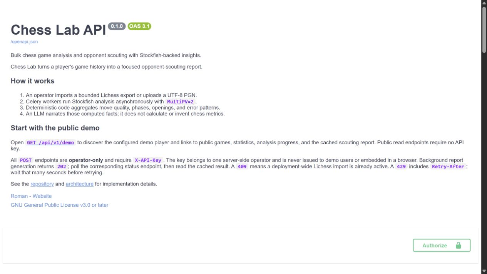
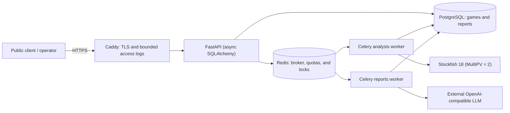
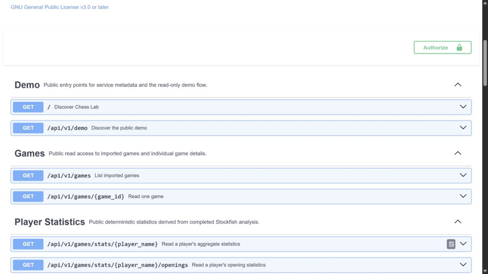
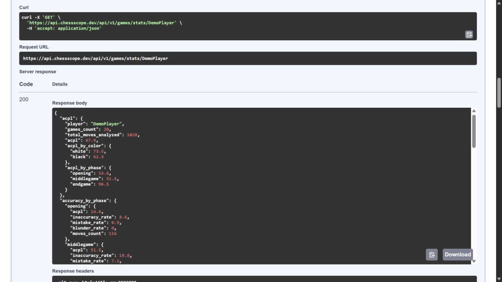
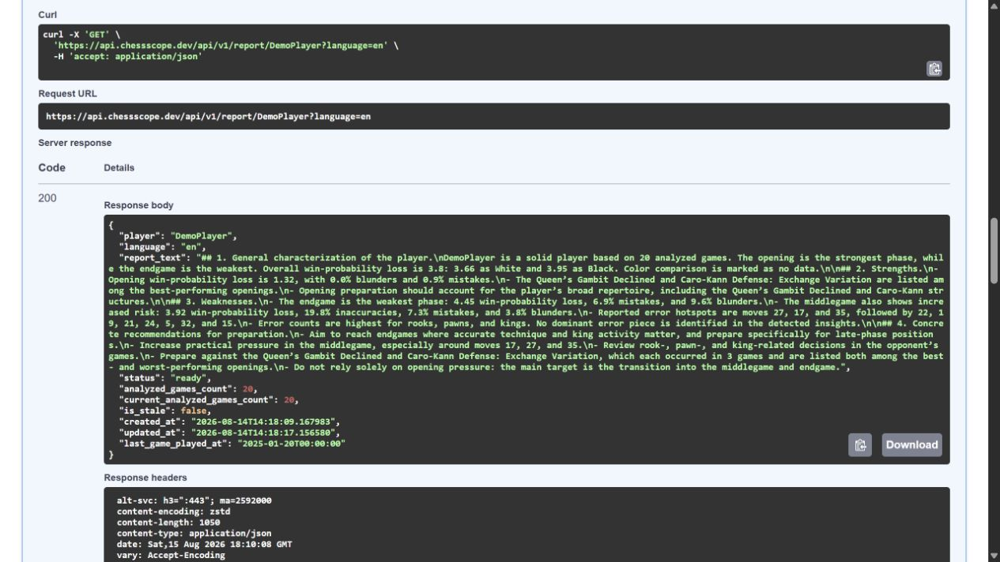

# Chess Lab

[](https://github.com/Roman2050/chess-lab/actions/workflows/ci.yml)

Bulk chess game analysis and opponent scouting with Stockfish-backed insights.
Chess Lab turns a game history into deterministic performance statistics and a
cached scouting report for focused preparation.
Current API/package version: **0.1.0**. Maintained by
[Roman](https://github.com/Roman2050).

[**Live API**](https://api.chessscope.dev/) ·
[**Swagger**](https://api.chessscope.dev/docs) ·
[**Demo Stats**](https://api.chessscope.dev/api/v1/games/stats/DemoPlayer) ·
[**Demo Report**](https://api.chessscope.dev/api/v1/report/DemoPlayer?language=en)



## Live demo

The production demo is read-only and requires no API key. It uses the stable public
alias `DemoPlayer`, so a reviewer can inspect the result without supplying a nickname
or creating an account.

| Start here | What it shows |
|---|---|
| [Demo discovery](https://api.chessscope.dev/api/v1/demo) | The demo player and all supported public links |
| [Analyzed games](https://api.chessscope.dev/api/v1/games?player_name=DemoPlayer) | Paginated pseudonymized game summaries |
| [Analysis status](https://api.chessscope.dev/api/v1/analyze/player/DemoPlayer/status) | Database-backed progress for the demo dataset |
| [Player statistics](https://api.chessscope.dev/api/v1/games/stats/DemoPlayer) | ACPL, phase accuracy, and recurring error patterns |
| [Opening statistics](https://api.chessscope.dev/api/v1/games/stats/DemoPlayer/openings) | Results and move-quality metrics by opening |
| [Move-number statistics](https://api.chessscope.dev/api/v1/games/stats/DemoPlayer/moves) | Accuracy and win-probability loss by move number |
| [Cached scouting report](https://api.chessscope.dev/api/v1/report/DemoPlayer?language=en) | LLM-narrated conclusions computed from deterministic facts |

The raw API responses are intentionally visible: Chess Lab is a backend portfolio
project, and Swagger is its interactive demonstration UI.

## How it works

1. An operator imports a bounded Lichess export or uploads a UTF-8 PGN.
2. The API stores games idempotently in PostgreSQL and queues bounded background work.
3. A dedicated Celery worker runs Stockfish with `MultiPV = 2`.
4. Deterministic code computes move quality, game-phase accuracy, opening performance,
   tactical error patterns, and win-probability loss.
5. A separate report worker asks an OpenAI-compatible model to narrate those facts.
6. The finished report is cached in PostgreSQL and served through a public read endpoint.

The LLM is a narrator, not the chess analyst: it never queries the database and does
not calculate or invent the metrics used in the report.

## Architecture



Production runs these roles as separate containers from one immutable application
image. Only Caddy publishes host ports; PostgreSQL, Redis, Uvicorn, and both workers
remain on private Docker networks. See [ARCHITECTURE.md](ARCHITECTURE.md) for data
contracts, task claims, and storage invariants.

## Production results

### Public entry points



### Deterministic player statistics



### Cached scouting report



## Engineering highlights

- Stable, idempotent game identity for both Lichess imports and custom PGNs.
- Case-insensitive player lookup backed by PostgreSQL functional indexes.
- Bounded uploads, upstream responses, batch fan-out, report languages, and request
  quotas.
- Deployment-wide Redis single-flight and cooldown handling for Lichess exports.
- Atomic database claims prevent duplicate Stockfish and report work.
- CPU-bound analysis and I/O-bound report generation use isolated Celery queues.
- Stockfish runs outside the async event loop and outside long-lived DB transactions.
- Heavy PGN and JSONB columns are not loaded on read paths that do not use them.
- Error-only FEN storage limits database growth while preserving training positions.
- Structured, bounded logs exclude secrets, PGNs, prompts, and report text.
- Immutable GHCR images carry source revision, version, provenance, and license metadata.

## API workflow

### Public demo flow

Run these commands in a Bash terminal. On Windows, use WSL:

```bash
curl --fail --show-error https://api.chessscope.dev/
curl --fail --show-error https://api.chessscope.dev/api/v1/demo
curl --fail --show-error https://api.chessscope.dev/api/v1/games/stats/DemoPlayer
curl --fail --show-error \
  'https://api.chessscope.dev/api/v1/report/DemoPlayer?language=en'
```

### Operator workflow

Every mutating or expensive `POST` requires the server-side `X-API-Key`. The key is
never exposed in this repository, the demo, screenshots, or browser code.

```bash
export CHESS_LAB_API_URL='http://localhost:8000'
export CHESS_LAB_PLAYER='ExamplePlayer'

curl --fail --show-error \
  --request POST \
  --header "X-API-Key: ${CHESS_LAB_API_KEY}" \
  "${CHESS_LAB_API_URL}/api/v1/analyze/player/${CHESS_LAB_PLAYER}"

curl --fail --show-error \
  "${CHESS_LAB_API_URL}/api/v1/analyze/player/${CHESS_LAB_PLAYER}/status"

curl --fail --show-error \
  --request POST \
  --header "X-API-Key: ${CHESS_LAB_API_KEY}" \
  "${CHESS_LAB_API_URL}/api/v1/report/${CHESS_LAB_PLAYER}?language=en"

curl --fail --show-error \
  "${CHESS_LAB_API_URL}/api/v1/report/${CHESS_LAB_PLAYER}?language=en"
```

Do not place real keys directly in commands committed to source control. Set them in
the current shell or a local ignored environment file.

## Local Docker quick start

Prerequisites: Docker, [uv](https://docs.astral.sh/uv/), Python 3.12, and a local
Stockfish executable for analysis. An OpenAI-compatible service is needed only for
report generation.

Run these commands from the repository root in Bash or WSL:

```bash
cp .env.example .env
docker compose up -d db redis
uv sync --dev
uv run python scripts/download_eco.py
uv run alembic upgrade head
uv run uvicorn app.main:app --reload
```

Before starting the API, edit `.env` and set a fresh `MVP_API_KEY`, a monitored
`LICHESS_USER_AGENT`, and the correct `STOCKFISH_PATH`. Never commit `.env`.

Start the workers in two additional Bash or WSL terminals:

```bash
uv run celery -A app.tasks.celery_app.celery_app worker \
  -Q analysis --concurrency=1 --loglevel=info
```

```bash
uv run celery -A app.tasks.celery_app.celery_app worker \
  -Q reports --concurrency=1 --loglevel=info
```

The production workers use prefork. For a native Windows development shell, append
`--pool=solo`; this is not needed inside WSL.

After startup, open `http://localhost:8000/docs` or verify the service from Bash:

```bash
curl --fail --show-error http://localhost:8000/health
curl --fail --show-error http://localhost:8000/ready
curl --fail --show-error http://localhost:8000/api/v1/demo
```

`data/eco.json` is generated from the immutable upstream revision recorded in
[THIRD_PARTY_NOTICES.md](THIRD_PARTY_NOTICES.md) and is intentionally ignored by Git.

## Tests and quality gates

Run the same checks used by CI from the repository root in Bash or WSL:

```bash
docker compose up -d db_test
uv sync --frozen --dev
uv run --no-sync python scripts/download_eco.py
uv run --no-sync ruff check app tests scripts
uv run --no-sync ruff format --check app tests scripts
uv run --no-sync python scripts/check_lichess_http_boundary.py
uv run --no-sync pytest
```

Unit tests require no database or network. Integration tests use the dedicated
`db_test` PostgreSQL service. CI additionally builds the production Dockerfile,
checks application imports and OCI labels, and smoke-tests the container health
endpoint. Lichess and LLM calls are mocked in automated tests.

## Production deployment overview

The production topology is defined in
[compose.production.yaml](compose.production.yaml). API, migration job, analysis
worker, and reports worker use the same explicit GHCR image reference. Deployment
uses a full commit tag or verified digest, never `latest` and never a source bind
mount.

The controlled order is:

1. Pull the exact image.
2. Validate the rendered Compose and Caddy configuration.
3. Start PostgreSQL and Redis.
4. Run the one-shot Alembic migration job.
5. Start API, workers, and Caddy.
6. Verify HTTPS, public endpoints, container health, queues, and deployed digest.

Complete commands, safety checks, warm worker shutdown, and exact rollback are in the
[deployment runbook](docs/runbooks/deployment.md). The sanitized settings contract is
[.env.production.example](.env.production.example); the real `.env.production` stays
on the server with restricted permissions.

### Production image

The public Linux x86-64 image is published as
`ghcr.io/roman2050/chess-lab`. Release images carry both a semantic version tag and
the full source commit tag, plus OCI source, revision, version, license, and provenance
metadata. Production is pinned to the verified content digest.

For a release, anonymous verification requires no repository checkout:

```bash
docker pull ghcr.io/roman2050/chess-lab:v0.1.0
docker image inspect ghcr.io/roman2050/chess-lab:v0.1.0 \
  --format '{{ index .Config.Labels "org.opencontainers.image.revision" }}'
```

## Operations and safety

- Only Caddy exposes `80/tcp` and `443/tcp`; PostgreSQL, Redis, and Uvicorn are
  internal-only.
- Caddy manages HTTPS automatically, caps request bodies, and emits filtered JSON
  access logs without headers or query strings.
- Application logs are structured, secret-safe, and bounded by Docker log rotation.
- `/health` checks process liveness; `/ready` checks Redis availability and never
  contacts Lichess.
- Production updates inspect active and reserved Celery tasks before warm worker
  shutdown.
- PostgreSQL backups are encrypted off-server and verified with disposable restore
  drills.
- Previous verified image digests are preserved as rollback targets.

Operational procedures:

- [deployment and rollback](docs/runbooks/deployment.md)
- [DNS and TLS](docs/runbooks/dns-tls.md)
- [backup and restore](docs/runbooks/backup-restore.md)
- [Celery recovery](docs/runbooks/celery-recovery.md)
- [incident response](docs/runbooks/incident.md)
- [runtime observability](docs/runbooks/observability.md)
- [Lichess operations](docs/runbooks/lichess.md)

## Known MVP limitations

- There is no frontend application; Swagger and raw JSON are the public UI.
- The demo is read-only. Imports, uploads, analysis requests, and report generation
  remain operator-only.
- The MVP uses one operator API key rather than user accounts, sessions, or OAuth.
- Lichess import is synchronous, bounded, and deployment-wide single-flight; there is
  no import-job resource or incremental synchronization cursor.
- A worker killed during analysis can leave a stale `running` row; recovery is a
  controlled operator procedure rather than an automatic lease reaper.
- The deployment uses one VPS and has no high-availability or automatic SSH deploy.
- Redis queues have no exactly-once delivery guarantee or Celery result backend;
  PostgreSQL stores application progress and report state.

These constraints are deliberate boundaries for a small, auditable portfolio
deployment rather than unfinished public features.

## License and third-party notices

Copyright © 2026 Roman Kozhemiachenko.

Chess Lab is licensed under the [GNU General Public License version 3 or
later](LICENSE) (`GPL-3.0-or-later`). Attribution, exact source revisions, and
distribution terms for python-chess, Stockfish, and the ECO opening dataset are
recorded in [THIRD_PARTY_NOTICES.md](THIRD_PARTY_NOTICES.md).

Chess Lab is independent and is not affiliated with, endorsed by, or sponsored by
Lichess or the Stockfish project.
